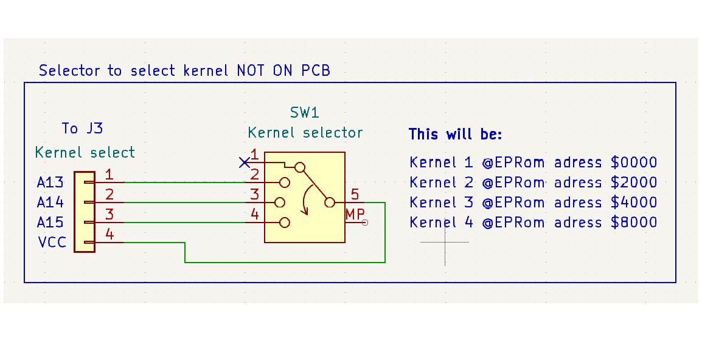
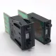

# A Kernel switch for the Commodore 64
# SernelSwitchSST

This is a kernel switcher for the commodore 64, i have de c model, i its only tryed in that one.
You need to switch the "old kernel" out with this PCB

Project is made in KiCad 8.0
Project is still works in progress, so don't make one before i have made one.

## Diagram
<a href="KernelSwitchSch.pdf" class="image fit">Diagram of Kernel switch.</a>

## Switch kernel
A13, A14 and A15 is all pulldown to low by a 1K res. So to select another address (Kernel), you only need to pull it high.

### Always switch of your C64 before you pick a new Kernel.
If you do nothing to the J3 "Kernel select" pin's, then the kernel will start at address $0000 In the EPRom. And the C64 will boot from that.

#### If you connect a 4 Pole switch to the J3 this way, then you can switch between 4 different kernel's

### Program a new kernel
The EPRom is a 27C512, and can hold 4 Easy access kernels. 8 Kilo byte. pr kernel.

When you program the 27C512 you most place them in different plases in the EPRom.

For The Kernel 1, The default plase for a kernel without anything connectet to J3) You most place it at Address $0000 in the EPRom.

Kernel 2 at place $2000

Kernel 3 at place $4000

Kernel 4 at place $8000

### Advance kernel selecter.
We can have many more kernels in the 27C512. Up to 8 In advance mode.

| **Pin NO J3** | **Add**       | 1     | 2     | 3     | 4     | 5     | 6     | 7     | 8     |
| :---:         | :---:         | :---: | :---: | :---: | :---: | :---: | :---: | :---: | :---: |
| 1             | A13           | L     | H     | L     | H     | L     | H     | L     | H     |
| 2             | A14           | L     | L     | H     | H     | L     | L     | H     | H     |
| 3             | A15           | L     | L     | L     | L     | H     | H     | H     | H     |
| 4             | VCC           |       |       |       |       |       |       |       |       |
|               | EPRom Hex add | $0000 | $2000 | $4000 | $6000 | $8000 | $A000 | $C000 | $E000 |

Maby in the future i will make a diagram of a advance kernel selector. Or maby you will make one?

Maby i will use this one.

From:

<a href="https://www.aliexpress.com/item/1005002702991282.html" class="image fit">High Quality 24mm X 7.62mm 0-9 Bit BCD Code 8421 Binary Output Dial Push Wheel Switch, Black</a>

## Picture generatet by KiCad 8.0

